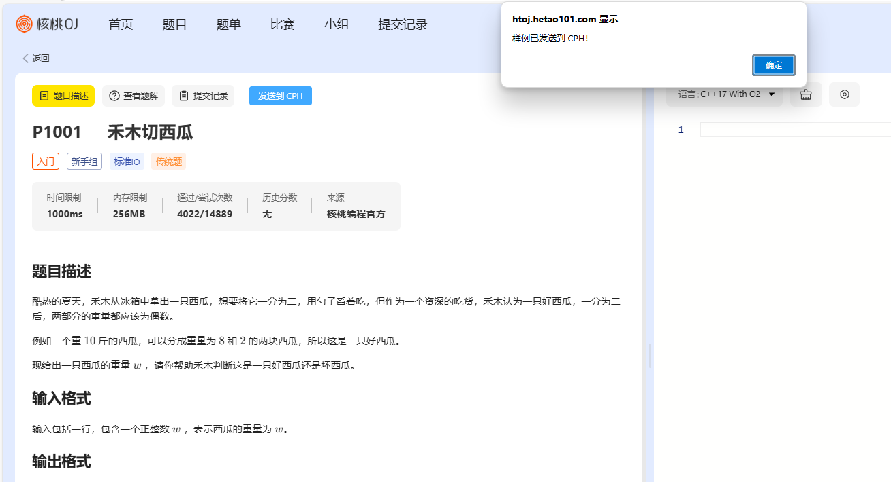
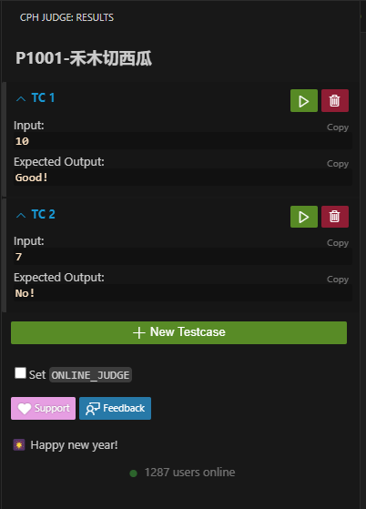

# better-hetao

更好的核桃 OJ。

## 功能

- 自动传送样例至 cph
- (欢迎提功能需求)

## 安装插件

1. 安装油猴插件

    在浏览器中安装油猴插件，例如 Edge/Chrome 的 Tampermonkey。

2. 安装脚本
   从 release 页面下载最新的脚本，然后在油猴插件中导入脚本。

3. 打开核桃 OJ 的题目页面，刷新即可看到插件生效。

## 使用

1. 打开安装有 cph 的 vscode，在核桃 OJ 的题目页面点击“发送到 cph”按钮，即可在 cph 看见样例组。
   

